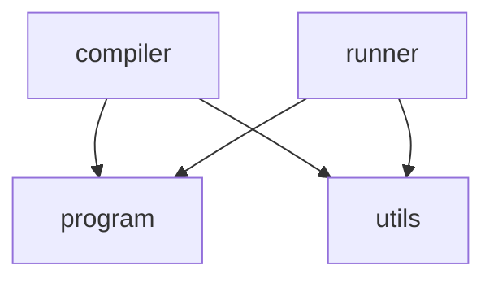
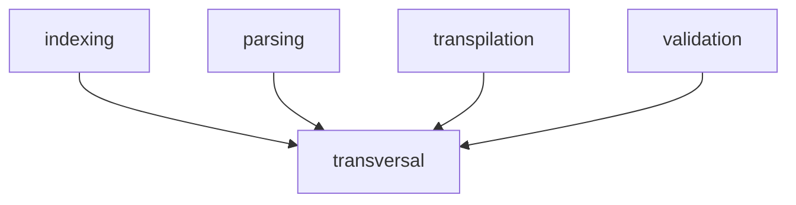
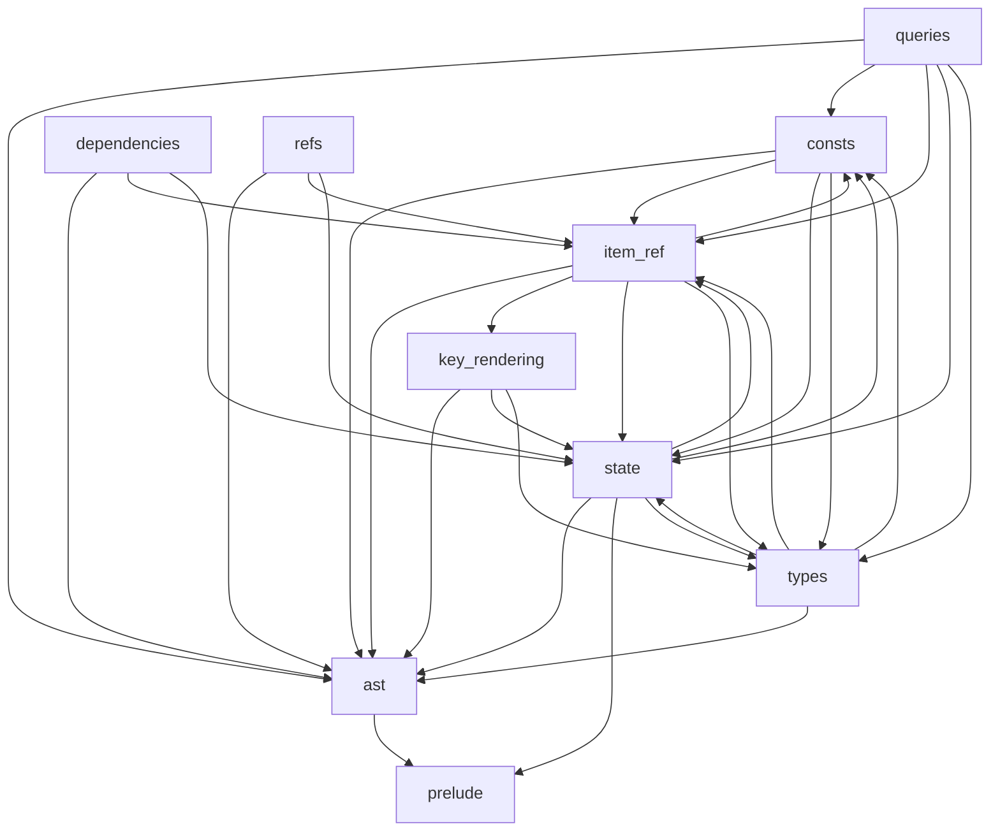

# High-level architecture

## Compiler passes

The compiler follows a multi-pass pipeline defined in `src/compiler/mod.rs`:

1. **Read**: Loads built-in prelude files and reads `.gpex` files from a folder recursively
   (`src/compiler/transversal/prelude.rs`, `src/utils/reading.rs`)
2. **Parse**: Parse read files to produce an AST per file (called a "module")
   (`src/compiler/parsing/`, AST types in `src/compiler/transversal/ast/`)
3. **Index**: Builds symbol tables, e.g., to index imports and items for following stages
   (`src/compiler/indexing/`)
4. **Validate**: Semantic checks (type checking, circular dependency detection, naming
   conventions, ...) via `src/compiler/validation/`
5. **Transpile**: Converts ASTs to JSON file containing WGSL of each shader to execute
   (`src/compiler/transpilation/`)
6. **Run** (optional): Executes WGSL compute shaders on the GPU via wgpu (`src/runner/`)

## Key directories and files

- `src/compiler/`: Compilation pipeline orchestration and definition of each pipeline stage:
    - `parsing/`: Parse functions that turn source files into AST nodes (modules, imports, items,
      expressions, statements).
    - `indexing/`: Symbol table construction (imports, item references, type-fact inference, ...).
    - `validation/`: Semantic validation passes (type comparison, circular dependency
      detection, ...).
    - `validation/logs/`: Construction of user-facing compiler errors, warnings, and hints.
    - `transpilation/`: AST-to-WGSL conversion.
    - `transversal/`: Shared helpers used across compiler passes:
        - `ast/`: AST types, non-parse methods on those types, and language constants (keywords,
          symbols, operator names, ...).
        - `state/`: Shared post-parse compiler state used by indexing, validation, value
          resolution, dependency analysis, and transpilation.
        - `item_ref.rs`: Shared item-reference representation used across compiler passes.
        - `dependencies.rs`: Item dependency resolution.
        - `key_rendering.rs`: Rendering of item keys for compiler logs.
        - `prelude.rs`: Built-in types and functions.
        - `queries/`: AST predicates that require the shared compiler state.
        - `refs.rs`: Reference checking (in this context, a reference is an expression that is
          permitted on the left-hand side of an assignment statement).
        - `consts/`: Constant value resolution.
        - `types.rs`: Type resolution.
- `src/program.rs`: Compiled program representation.
- `src/runner/`: Execution of a compiled program on GPU using WGPU.
- `src/utils/`: Reusable compilation utils, for file reading, parsing, logging, ...
- `prelude/`: built-in types and functions available in all `GPEx` modules.

## Module coupling

Each graph shows coupling between direct sub-modules of the heading's folder. An arrow `A --> B`
means that at least one Rust file under `A` refers to `B` via `crate::B` or via a crate-root
re-exported name that originates from `B` (for example `use crate::Log` when `Log` is `pub use`d
from `utils`). Nested paths are collapsed to the nearest documented child of that folder:
`crate::compiler::transversal::consts` is `compiler` under `src/`, `transversal` under
`src/compiler/`, and `consts` under `src/compiler/transversal/`. Same-module paths are omitted.

### `src/`

### `src/compiler/`

### `src/compiler/transversal/`

